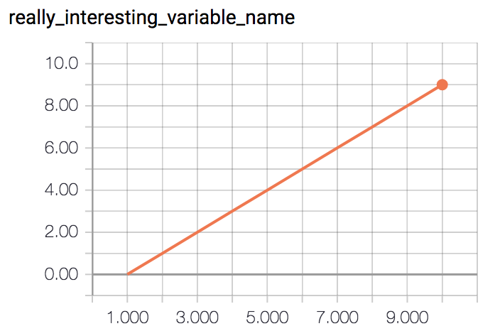

# Easy TensorFlow Logging

It happens to me all the time that I'm prototyping something and just want to
be able to _magically_ graph some value from code without going through all the
usual steps to set up TensorFlow logging properly.

`easy_tf_log` is a simple module to do just that. Just

```
from easy_tf_log import logkv
```

then you can do e.g.

```
for i in range(10):
    logkv('really_interesting_variable_name', i)
```

and you'll find a directory `logs` that you can point TensorBoard to!



Based on heavily stripped-down code from OpenAI's [baselines](https://github.com/openai/baselines).

## Installation

For TensorFlow without GPU support:

`pip install git+https://github.com/mrahtz/easy-tf-log#egg=easy-tf-log[tf]`

For TensorFlow *with* GPU support:

`pip install git+https://github.com/mrahtz/easy-tf-log#egg=easy-tf-log[tf_gpu]`

## Usage

On import, `easy_tf_log` sets up a logger saving to a directory `logs`. To
change the directory it logs to, call `easy_tf_log.set_dir(log_dir)`.

`logkv(key, value)`: log `value` with name `key`.
